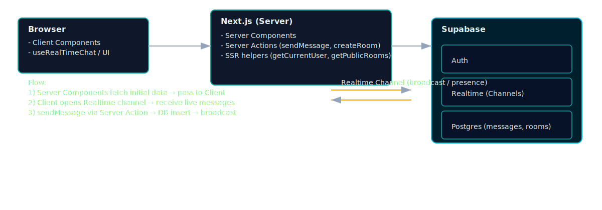

# Supa Chat (supabase-realtime-chat)

## 專案概述

- 專案名稱：Supa Chat
- 主要功能：使用 Next.js 與 Supabase 建置的即時聊天室示範專案，支援建立/加入房間、即時訊息、使用者註冊/登入/重設密碼與管理功能。
- 技術棧：
  - Next.js（App Router & Server Components）
  - TypeScript
  - Tailwind CSS（與 shadcn/ui-style 組件風格）
  - Supabase（Realtime、Auth、Postgres）
  - React hooks（自訂 hooks 管理即時與分頁）
- 目標用戶 / 使用場景：想快速學習或整合 Supabase Realtime 與 Next.js Server/Client Components 的前後端工程師、教學範例或 prototype。

## 專案結構（重點）

- `src/app/` - Next.js App Router（主要頁面與 Server Components）
  - `src/app/page.tsx` - 首頁 / 房間列表
  - `src/app/rooms/[id]/page.tsx` - 房間頁（Server -> ClientRoom）
  - `src/app/rooms/new/page.tsx` - 建立新房間
- `src/app/services/supabase/` - Supabase clients、server actions 與 types
  - `client.ts` / `server.ts` - 建立 browser/server supabase client
  - `actions/` - `messages.ts`、`rooms.ts`、`admins.ts` 等 server actions
  - `types/database.types.ts` - DB types（auto-generated）
- `src/components/ui/` - 共用 UI 元件（Button、Input、Empty、Card 等）
- `src/app/rooms/[id]/components/` - 聊天相關 Client 組件與 hooks
  - `ClientRoom.tsx`, `ChatInput.tsx`, `ChatMessage.tsx`
  - `hooks/useRealTimeChat.ts`, `hooks/useInfiniteScrollChat.ts`
- 其他：`src/proxy.ts`、`src/app/components/NavigationRefresh.tsx`（處理返回鍵刷新問題）

## 核心功能

- 主要頁面與功能：
  - 首頁（房間列表）：顯示公開房間與使用者已加入房間。
  - 建立房間：表單觸發 server action 建房與設定成員。
  - 房間頁（聊天室）：Server Component 取回初始資料，Client Component 處理即時訊息與 UI。
  - 使用者管理：註冊 / 登入 / 忘記密碼 / 更新密碼。

- 資料流程（簡述）：
  1. Server Component（例如 `src/app/rooms/[id]/page.tsx`）呼叫 server helper（`getRoom`、`getMessages`）從 Supabase 讀資料。
  2. Server Component 將初始資料傳給 Client Component（`ClientRoom`）。
  3. Client Component 啟動 `useRealTimeChat` 建立 Supabase channel（broadcast / presence）接收即時事件；`useInfiniteScrollChat` 負責向後分頁加載舊訊息。
  4. 發送訊息時，Client 透過 server action（`sendMessage`）在 server 端寫入 DB，並由 realtime channel 廣播到其他客戶端。

## 安裝與啟動

1. 複製環境變數：請參考 `.env.example` 建立 `.env.local`（填入 NEXT_PUBLIC_SUPABASE_URL、NEXT_PUBLIC_SUPABASE_ANON_KEY、SUPABASE_SERVICE_ROLE_KEY 等）。
2. 安裝依賴：
```bash
npm install
```
3. 開發模式：
```bash
npm run dev
```
4. 建置與啟動：
```bash
npm run build
npm run start
```

（scripts 詳情請參考 `package.json`）

## 主要元件

- Server Components 使用方式：
  - 在 page 或 layout 的 Server Component 中呼叫 server helper（例如 `getCurrentUser`、`getPublicRooms`、`getRoom`）以同步方式讀取資料，再將結果以 props 傳給 client-side component。示範見 `src/app/rooms/[id]/page.tsx`。

- UI Components（重點）：
  - `Empty`（`src/components/ui/empty.tsx`）：空狀態顯示。
  - `ActionButton`（`src/components/ui/action-button.tsx`）：帶載入與確認的按鈕封裝。
  - `AlertDialog`, `Button`, `Input`, `Card` 等，遵循 shadcn/ui pattern 放在 `src/components/ui/`。

- 自訂 Hooks / Utils：
  - `useCurrentUser`（client-side hook）— 監聽 auth state 並返回當前使用者資訊。
  - `useRealTimeChat` — 建立與管理 Realtime channel（subscribe、事件處理、清理）。
  - `useInfiniteScrollChat` — 用 IntersectionObserver 做訊息分頁載入。

## API 整合（重點函式說明）

- `getCurrentUser`（server helper）
  - 功能：在 Server Component 中讀取當前 session 與 user 資訊（使用 server supabase client）。

- `getPublicRooms`（server helper）
  - 功能：取得公開房間清單，包含必要的 metadata（例如成員數）。

- `getJoinedRooms`（server helper）
  - 功能：取得特定使用者已加入的房間清單。

- `sendMessage`（server action，`src/app/services/supabase/actions/messages.ts`）
  - 功能：在 server 端插入訊息資料並回傳完整 message 物件（包含作者資料），供 client 更新 UI 與由 realtime channel 廣播。

- `createRoom` / `addUserToRoom`（server actions）
  - 功能：建立房間、建立 room member 紀錄並處理存取權限與錯誤。

## 已知問題與解決方案

- 瀏覽器返回鍵（back）不會重新觸發 Server Component 資料抓取：
  - 原因：Next.js 的頁面導航可能使用 client-side navigation，導致 Server Component 不會自動 refresh。
  - 解法：在需要重新抓取的頁面內加入 client wrapper（例如 `src/app/components/NavigationRefresh.tsx`），在 mount 或 navigation event 發生時呼叫 `router.refresh()` 強制重新抓取 Server Component。

- Realtime 使用建議：
  - 優先採用 broadcast channel，並在建立 channel 前檢查是否已訂閱以避免重複，離開時務必移除 channel。參考 `useRealTimeChat` 的實作。

---

如果你要我補上圖片、架構圖或英文版本，或幫你把 README 放到其他路徑，告訴我下一步要補強的章節。

## 架構圖

下方架構圖展示了主要資料流程與組件：瀏覽器端的 Client Components（會使用 `useRealTimeChat` 與 UI 組件）向 Next.js Server（Server Components 與 Server Actions）取得初始資料與執行 server action，Server 與 Client 之間透過 Supabase Realtime channel 做即時訊息傳播，而最終資料儲存在 Supabase Postgres。



